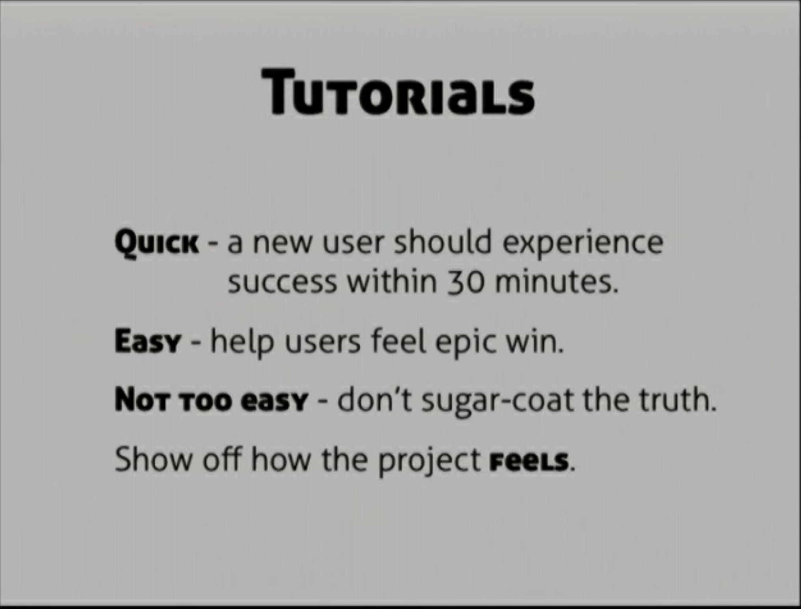
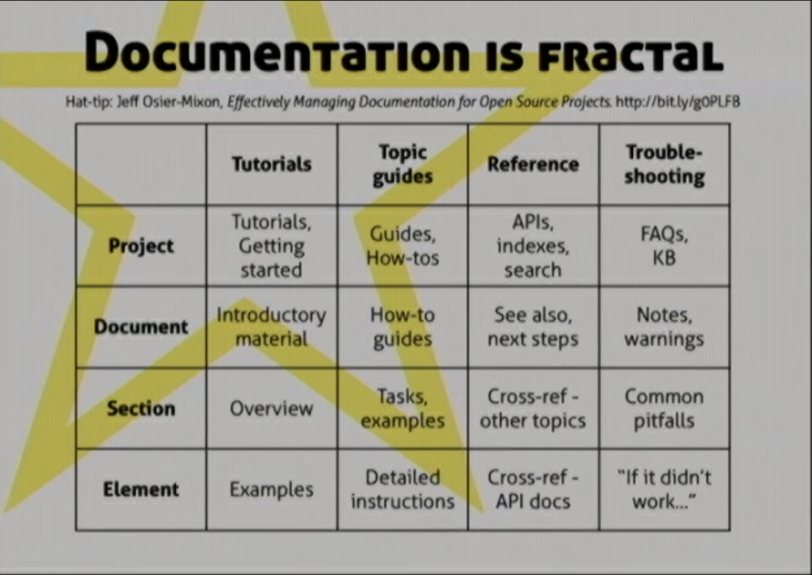

# 2020-05

## Writing good documentation (or at least trying)

Hopefully some useful tips will be implemented, otherwise these docs will be horrible. Resource notes:

### Writing effective documentation - Beth Aitman

https://www.youtube.com/watch?v=R6zeikbTgVc

- Heading: **Writing a custom code generator** instead of **Custom code generator**  
  Preons can therefore have, "Create your own functional css framework and systemize UI generation". 🙄😅

### Writing great documentation - Jacob Kaplan-Moss

https://www.youtube.com/watch?v=z3fRu9pkuXE

- Create a tutorials that deliver the tools' capability in less than 30 minutes.
- Then have a topical guide for more in-depth help
- Autogenerated reference is not a good substitute for documentation written by people
- FAQs - answers to questions for people when they are angry

For each part of the docs, you need the 4 items:

1. Tutorial (Get started)
2. Guide
3. Reference
4. Trouble-shooting

## Codejs Nuxt issues

https://github.com/nuxt/nuxt.js/issues/6336#issuecomment-561861147

> I'm sorry, this didn't work for me.
> This worked: yarn add -D core-js@2 @babel/runtime-corejs

How to downgrade corejs.
